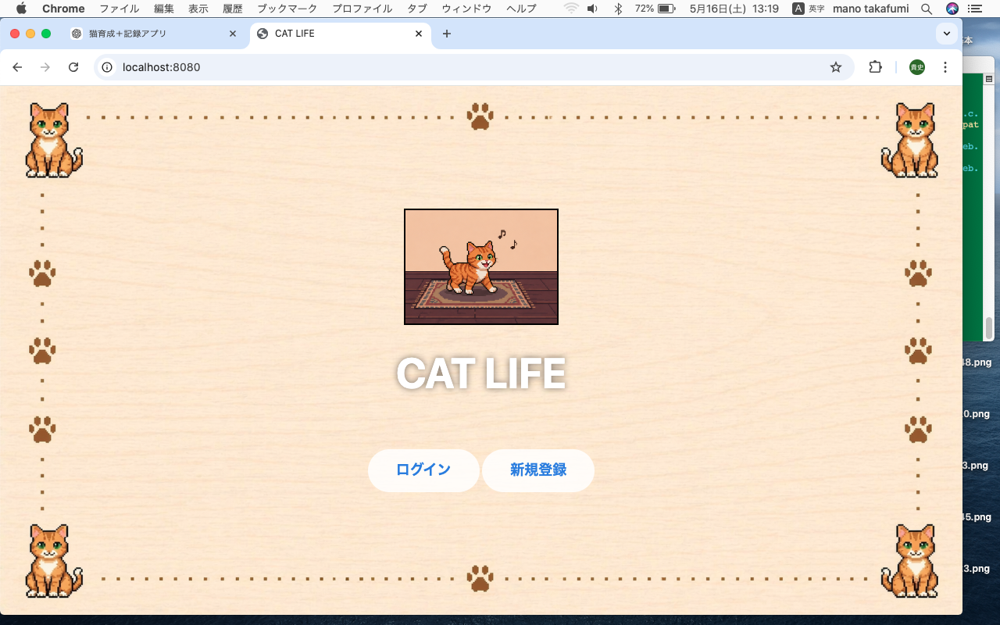
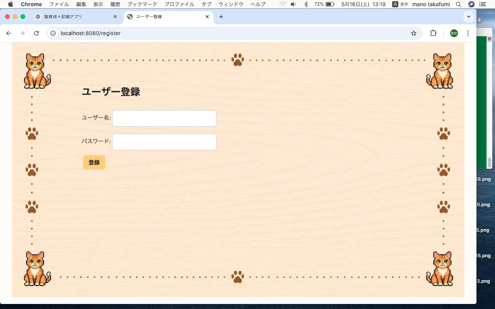
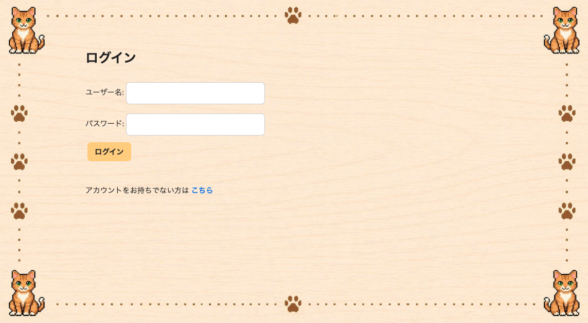
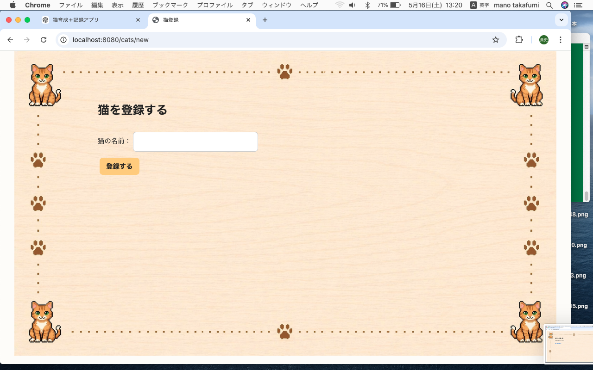
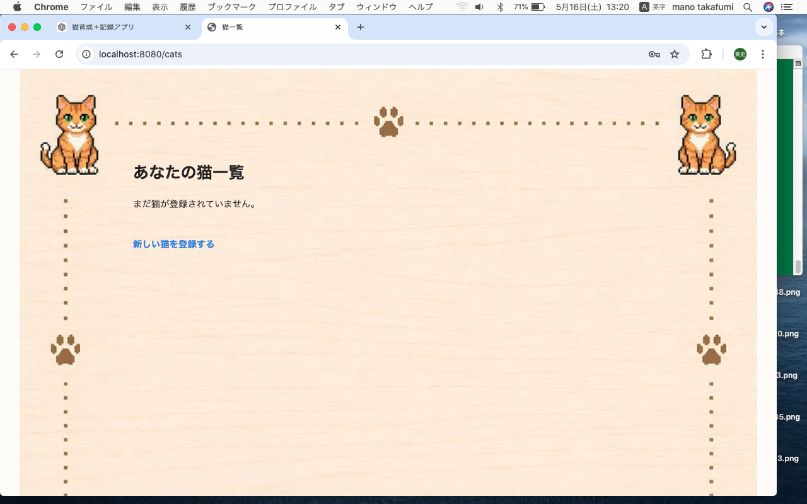

# CAT LIFE

Spring BootとJavaScript(fetch API)を用いて開発した猫育成Webアプリです。 

---

## アプリ概要

猫の育成を簡単に体験し、猫の可愛さを感じるWebアプリです。 
ごはん・遊ぶ・寝るなどの行動ボタンを押すことによってステータスが変化します。 
一定数の数値を超えることでレベルアップし、時間経過でも数値の減少があります。

---
## 使用技術

- Java
- Spring Boot(framework)
- Spring Security(login / logout)
- Thymeleaf
- HTML5/CSS3
- JavaScript
- H2 Database(開発中なのでMySQLに変更予定)

---
## 機能一覧

### 実装機能

- ユーザー登録 / ログイン
- 猫登録 / 削除
- ごはんをあげる / 遊ぶ / 寝る機能
- レベルアップ
- 各数値のランダム上昇機能
- 残り体力による行動制限機能
- 時間経過によるステータス減少
- Ajaxによる非同期更新
- 画像切り替え

---
## 工夫した点

- fetch APIを使用することでページリロードなしのスムーズな画面更新を実装
- @Scheduledを使い時間経過によるステータス減少を実装
- 猫の状態（空腹度・元気・体力）に応じて画像やテキストをわかりやすく切り替えるように実装
- Java側での状態管理、JavaScriptで画面表示を切り替える

---
## スクリーンショット

### タイトル画面

### ユーザー登録画面

### ログイン画面

### 猫登録画面

### 猫リスト画面

### ゲームプレイ画面

---
## 今後追加予定

- 猫のレベルアップによる進化機能
- アイテム機能などの追加
- セーブデータや猫ごとの詳細ステータス保存
- 画像での切り替えからアニメーションに変更

---